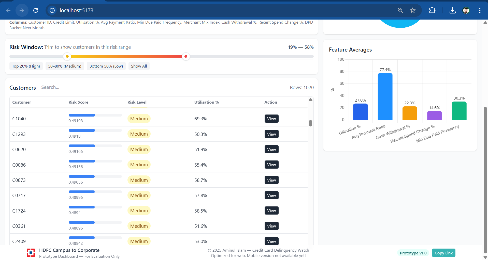

# 📄 **Credit Card Delinquency Watch — Early Risk Detection Dashboard**

---

## 📊 **Project Presentation**

* 👉 **[Download PowerPoint (PPTX)](docs/presentation/Presentation.pptx)**
* 👉 **[View PDF Version](docs/presentation/Presentation.pdf)**

> 📌 **Evaluators are requested to view the PPT first** for a complete walkthrough of the system and workflow.

---

# 📄 **Credit Card Delinquency Watch — Early Risk Detection Dashboard**

<p align="center">
  
</p>

---


## 🚀 **Overview**

**Credit Card Delinquency Watch** is an end-to-end system designed to detect **early warning signals** in customer repayment behaviour.
It simulates how modern banks proactively identify customers who may become delinquent in the coming months.

This tool enables risk teams to:

* Upload monthly behavioural customer data
* Generate **interpretable risk scores**
* Categorize customers into **Low / Medium / High Risk**
* View customer-level insights, explanations, and recommended actions
* Monitor portfolio health with clean visual analytics

---

## 📦 **How to Run Locally**

### 🖥️ **Backend Setup**

```bash
cd backend
python -m venv .venv
```

#### Activate Virtual Environment (Windows)

```bash
.\.venv\Scripts\activate
```

#### Install Dependencies

```bash
pip install -r requirements.txt
```

#### Start Backend Server

```bash
python -m uvicorn app:app --reload --port 8000
```

Backend runs at: **[http://127.0.0.1:8000](http://127.0.0.1:8000)**

---

### 🌐 **Frontend Setup**

```bash
cd frontend
npm install
npm run dev
```

Frontend runs on: **[http://localhost:5173](http://localhost:5173)**

---

## 📤 **How to Use the Dashboard**

1. Open the dashboard in your browser  
2. Click **Choose CSV → Select dataset from the `data/` folder inside the project**  
3. Recommended demo files (already cleaned and formatted for the system):  
   - `data/dataset1.csv`  
   - `data/dataset2.csv`  

   > 📌 **Please use the sample datasets above for testing.**  
   > They are pre-cleaned, correctly structured, and aligned with the scoring engine requirements.

4. After uploading, the dashboard automatically updates:  
   - Risk categories (Low / Medium / High)  
   - KPI tiles  
   - Risk distribution pie  
   - Feature-level averages  
   - Customer table  

5. Click **View** next to any customer to see:  
   - Individual risk explanation  
   - Top contributing behavioural features  
   - Suggested actions  
   - Raw values for audit  

---

## 🎯 **Problem Statement**

Banks lose substantial revenue when customers transition through delinquency stages (DPD 1–30 → 31–60 → 61+).
Traditional systems react **late**, after risk has already escalated.

This project addresses:

✔ Early detection of risky behavioural patterns
✔ Transparent and interpretable risk scoring
✔ Customer-level explanations
✔ Portfolio monitoring tools for risk managers

---

## 🧠 **Approach & Architecture**

The system uses a **3-layer risk evaluation pipeline**:

---

### **1️⃣ Data Sanitization**

Converts raw CSVs into clean structured inputs:

* Utilisation %
* Avg Payment Ratio
* Min Due Paid Frequency
* Merchant Mix Index
* Cash Withdrawal %
* Recent Spend Change %
* Next Month DPD Bucket (label)

---

### **2️⃣ Risk Scoring Engine (`scoring.py`)**

A custom interpretable model generates:

* `risk_score` (0–1)
* `risk_class`
* `top3_contributors`
* `recommended_actions`

Scoring is based on:

* Spend change behaviour
* Payment frequency
* Utilisation band
* Cash withdrawal patterns
* Merchant diversification

---

### **3️⃣ Interactive Dashboard (React)**

Provides an operational view used by risk analysts:

* KPI Summary Cards
* Pie Chart (Risk Distribution)
* Bar Chart (Feature Averages)
* Double-handle **Risk Window Slider**
* Customer Detail Drawer with explanations

---

## ⭐ **Key Features**

### 📊 **Portfolio-Level Insights**

* High / Medium / Low risk KPI tiles
* Pie chart for quick distribution overview
* Bar chart of key behavioural features
* Risk Window slider for dynamic filtering

### 👤 **Customer-Level Insights**

* Full profile details
* Top contributors to risk
* Suggested actions (EMI restructuring, reminders, etc.)
* Raw feature values for audit
* Copy JSON for debugging

---

## 🛠️ **Tech Stack**

### **Backend**

* Python
* FastAPI
* Custom Scoring Engine
* CSV Ingestion & Processing

### **Frontend**

* React
* TailwindCSS
* Chart.js
* Vite

### **Other**

* Synthetic realistic datasets
* Offline scoring pipeline
* Zero ML model dependency (fast + interpretable)

---

<h2>🖼️ Dashboard Screenshots</h2>

<p align="center">
  <br><br>
  <br><br>
  
</p>

---

## 🏁 **Future Enhancements**

* ML-based scoring (Logistic Regression / XGBoost)
* Time-series behavioural trend analysis
* Automated SMS / Email triggers
* Case management workflow
* Advanced customer segmentation engine

---

## 👤 **Made By**

**Aminul Islam (Bulbul)**
B.Tech CSE — Gauhati University
📧 Email: **[aminul7535@gmail.com](mailto:aminul7535@gmail.com)**

*Passionate about applied AI, credit risk analytics, and full-stack engineering.*

---
