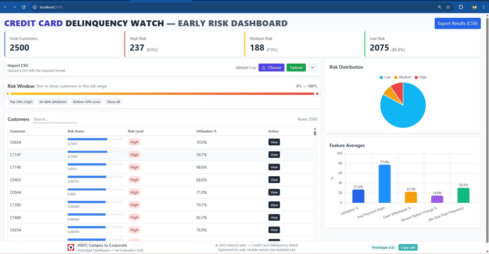

# 📄 **README — Credit Card Delinquency Watch (Early Risk Detection Dashboard)**

## 📦 **How to Run Locally**

### 1️⃣ Clone the repo

git clone https://github.com/your-repo/delinquency-watch.git
cd delinquency-watch

## 🖥️ **Backend Setup**
cd backend
python -m venv .venv

## Activate virtual environment (Windows)
.\.venv\Scripts\activate

## Install dependencies
pip install -r requirements.txt

## Start the backend server
python -m uvicorn app:app --reload --port 8000

## Backend runs at:
http://127.0.0.1:8000

## 🌐 **Frontend Setup**
cd frontend
npm install
npm run dev
Frontend runs on: http://localhost:5173

## 📤 **How to Use**

1. Open the dashboard
2. Click **Choose CSV → And select that dataset located in the data/ folder (e.g., dataset1.csv or dataset2.csv) → Upload**
3. Dashboard updates instantly:
   * Risk categories
   * Graphs
   * Customer table
4. Click **View** on any customer:
   * Risk explanation
   * Top contributors
   * Suggested actions
   * Raw values

## 🚀 Overview

**Credit Card Delinquency Watch** is an end-to-end system that detects early signs of credit-risk behaviour in credit card customers using a rule-based scoring engine and a clean, interactive dashboard.

The tool allows risk teams to:

* Upload monthly customer data
* Automatically generate risk scores
* Classify customers into **Low / Medium / High** risk
* View customer-level explanations & top contributors
* Trigger suggested early interventions

It is designed to simulate how banks (like HDFC / SBI / ICICI) monitor portfolio health for early delinquency prevention.

---

## 🎯 **Problem Statement**

Banks face financial losses when customers become delinquent (miss payments, roll to DPD 1–30 → DPD 31–60 → DPD 61+).
Traditional systems detect risk **too late**.

This project solves:
✔ Early detection of high-risk customers
✔ Explainable risk scoring
✔ Clear recommended interventions
✔ Portfolio-level insights for monitoring

---

## 🧠 **Approach**

The system follows a **3-layered risk evaluation pipeline**:

### **1️⃣ Data Sanitization**

Converts raw CSV inputs into clean numerical features:

* Utilisation %
* Avg Payment Ratio
* Min Due Paid Frequency
* Merchant Mix Index
* Cash Withdrawal %
* Recent Spend Change %
* DPD Bucket Next Month (label)

### **2️⃣ Risk Scoring Engine (scoring.py)**

A custom interpretable formula assigns score (0–1):

* Spend Change (increase/decrease)
* Avg Payment & Min Due Frequency
* Utilisation
* Cash Withdrawals
* Merchant Mix (low diversification → higher risk)

It outputs:

* `risk_score`
* `risk_class`
* `top3_contributors`
* `recommended_actions`

### **3️⃣ Interactive Dashboard (React)**

Built for real operational usage:

* KPI summary cards
* Pie chart distribution
* Bar chart feature averages
* Risk window slider for filtering customers
* Customer Drawer with full details & suggested actions

---

## ⭐ **Key Features**

### Portfolio-Level

* 📊 **KPI tiles**: High / Medium / Low risk counts
* 🥧 **Risk distribution pie chart**
* 📈 **Feature averages bar chart**
* 🎚️ **Risk Window slider** to view top/high/medium/low customers

### Customer-Level

* 🔍 Detailed drawer with profile
* 💡 Suggested next steps (EMI restructuring, reminders, limit suggestions)
* 🧩 Top risk contributors with visual bars
* 🧾 Full raw row values
* 📋 Copy JSON button for debugging

---

## 🛠️ **Tech Stack**

### Backend

* Python
* FastAPI
* Custom scoring engine
* CSV ingestion + processing

### Frontend

* React
* TailwindCSS
* Chart.js
* Vite

### Other

* Synthetic & realistic datasets
* Fully offline scoring
* No external ML model dependency

---

---

## 🖼️ **Screenshot of the Dashboard**

## 🏁 **Future Enhancements**

* ML-based scoring (Logistic Regression / XGBoost)
* Real transaction time-series visualization
* Automated customer calling/SMS triggers
* Case management panel
* Advanced segmentation engine

---

## 👤 Made by

**Aminul Islam (Bulbul)**
B.Tech CSE — Gauhati University
Email: aminul7535@gmail.com

Passionate about applied AI, credit risk, and full-stack engineering.
